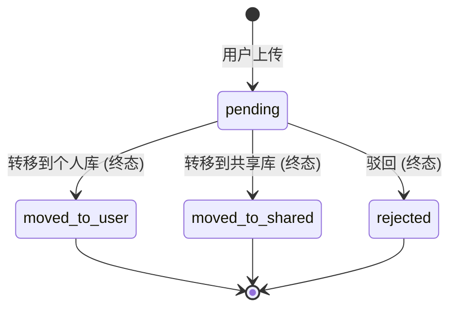

# DecipherStudy 项目迁移与整理说明 (2026-02-22)

为了提升项目的可维护性和专业性，我对项目结构进行了整理。以下是变动清单：

## 1. 结构变更映射表

| 原路径 | 新路径 | 说明 |
| :--- | :--- | :--- |
| `app.js` | `js/flashcards.js` | 主应用逻辑，重命名以体现功能 |
| `decoder.js` | `js/decoder.js` | 难题解码器逻辑 |
| `content-upload.js` | `js/uploader.js` | 上传与校验逻辑 |
| `decoder-schema.js` | `js/core/decoder-schema.js` | 核心协议定义（共享） |
| `qa-auditor.js` | `js/core/qa-auditor.js` | QA 审计引擎（共享） |
| `run-*.command` | `tools/*.command` | 快捷导入脚本移入工具包 |

## 2. 新增工程化支持
- **`package.json`**: 
    - `npm start`: 启动 Node.js 服务器。
  - ✅ **高标深度解析**：实现了“解读题目”、“已知条件”、“题目陷阱”与“详细解答”四位一体的专业 UI。
- ✅ **智能质量审计**：在上传端增加了 `practice-auditor.js`，自动识别解题步骤不足、LaTeX 语法风险及逻辑缺失，确保题库的高教学质量。

#### 1. 高标准深度解析演示（Labour Force 案例）

#### 2. 即时审计与质量拦截报告

## 3. 数据库友好型多租户架构 (Database-Ready)
- ✅ **存储抽象层**：引入 `storage/file-store.js`，收口所有 `fs` 操作，为未来迁移数据库提供统一接口。
- ✅ **API 驱动化**：前端全面弃用直接文件路径访问，改由 `/api/workspaces/:userId/...` 接口驱动。
- ✅ **原子化写入**：所有 JSON 落盘均采用“写临时文件+重命名”策略，彻底杜绝数据损坏风险。
- ✅ **Schema 标准化**：升级 `users.json` 并为每个工作区增加 `meta.json` 跟踪生命周期。
- ✅ **安全加固**：移除 `innerHTML` 渲染用户数据，预防潜在的 XSS 风险。

#### 4. 多租户 API 流程验证演示 (V3)

## 4. 安全审计与加固 (Security Remediation)
针对多租户架构进行的深度内审及修复：
- ✅ **稳定性修复**：补全了 `server.js` 缺失的 `require` 依赖，修复启动崩溃。
- ✅ **访问控制**：封禁静态服务对 `/content/` 的直接读取，强制必须通过 API 访问。
- ✅ **路径穿越防御**：引入 `resolveWorkspaceContext`，对 `userId` 进行白名单过滤（`[a-z0-9_-]+`）并深度校验工作区元数据及活跃状态。
- ✅ **文件名加固**：API 下载题库时强制校验 `.json` 后缀及安全字符。
- ✅ **XSS 彻底封杀**：首页用户卡片渲染全面重构为 DOM 原生 API（`textContent`），杜绝恶意显示名的脚本注入。
- ✅ **API 校验精细化 (Patch)**：
  - **中文文件名支持**：放宽了 `datasets` 接口的校验正则，现已完美支持包含中文、圆括号及 `-` 的文件名（如 `flashcard_统计学_统计学-第四周.json`）。
  - **严格类型校验**：`topics` 接口增加了 `type` 白名单（`flashcard|decoder|practice`），非法参数将返回 400，提高了接口的鲁棒性。
- ✅ **回归验证通过**：经验证，中文文件名可正常读取，路径穿越（如 `/../users.json`）已被成功拦截。
- ✅ **一键“智能修复” (New)**：
  - 移除了冗余的 “AI 修正指令” 提示。
  - 现已在上传器中集成 **Auto-Fix** 逻辑：检测到常见的 LaTeX 语法错误（如单反斜杠 `\sqrt`）或环境变量符号冲突时，支持一键自动修复。
  - 用户只需点击“立即自动修复”，系统将自动调整 JSON 文本并重新发起校验，极大提升了录题效率。
- ✅ **代码清理**：删除了 `server.js` 中所有遗留的旧版 JSON 读写与索引同步函数，全面切换至 `FileStore` 存储层。

#### 5. 智能修复验证演示 (Updated)

---
*整理人：Antigravity AI*

## 2026-02-23: 表格题 (question_table) 支持
为解答某些含有数据表的经济学问题，我们在 Practice 的数据结构里引入了 `question_table` 这一可选数据结构，主要应用于题干下方。

### 添加的功能
1. **渲染器 `js/practice.js`**:
   - 新增 `renderQuestionTable` 函数利用纯原生 table 和 Tailwind (针对 `overflow-x-auto` 提供滚动支持) 快速渲染。
   - `question_table` 结构中允许含 `title` (顶注) 与 `note` (底注)。
2. **校验规范 `js/core/qa-auditor.js` / `practice-auditor.js`**:
   - 新增 `QA_TABLE_001` 校验码。
   - 规定 `question_table` 字段若存在，则主体 `columns` 必须是非空一维数组，而 `rows` 必须为行列对齐的严格二维数组。
3. **架构兼容**:
   - 如果题目不含 `question_table`，仍走正常渲染路径；此字段完全按需增加。

## 5. Inbox Manager（审批流）

本章节介绍了 Inbox 待审阅池的核心状态流转机制，确保多租户数据在进入个人库或共享库前的安全管控。

### 状态流转图

### 操作规则与安全边界
- 只有处于 `pending` 状态的记录可以进行流转操作。
- `moved_to_user`、`moved_to_shared` 以及 `rejected` 均为不可逆的**终态**。
- **权限极严校验**：针对 Inbox 记录的**提取到个人库**、**发布到共享库**、**驳回**以及**查看详情**，系统严格校验请求来源。**仅本人可操作本人记录**（即 `reqUser === record.userId`），越权即返回 `403 Forbidden`。
- **物理文件前置校验**：在执行 `move-to-user` 或 `move-to-shared` 状态流转前，后端总会探针式验证底层源文件是否仍可完整读取，防止源文件丢失导致入库异常。
- **统一不删档原则**：本版本的审批流只做状态流转管控，**不做针对原始 JSON 实体文件的物理硬删除**，以保留审计容错空间。

### 数据落点流转说明
1. **Inbox 索引 (全量总控)**：所有提交都会在 `content/inbox/index.json` 中建立并实时更新状态索引记录。
2. **走向个人库**：
    - 实体原文件在用户的 `content/<userId>/<fileName>` 原位留存。
    - 将该记录指向个人的话题版图（如 `content/<userId>/flashcard_topics.json`）。
3. **走向共享库 (全局公海)**：
    - **科目自动规范化映射 (Subject Normalization)**：核心逻辑。**共享库目录必须使用英文稳定 `subjectId`，绝对不能直接使用中文学科名**。
    - **原则界定**：中文学科名（如“经济学”）**仅用于前端展示和用户上传时的输入选择**，但文件在后端流转发布共享库时，系统必须查阅 `content/shared/<schoolId>/school.json` 将其强制映射至稳定的英文 `subjectId`（如 `economics`）。
    - 文件最终会被拷贝并沉积至全局版图：`content/shared/<schoolId>/<subjectId>/<fileName>`，并入全局共享分发队列。
4. **拒绝收录**：
    - 文件在用户私有空间原封不动。
    - Inbox 索引打上红色 `rejected` 终结印记。

### 常见核心错误返回码
- `400 Bad Request`: 该记录不处于 `pending` 时试图执行动作（拦截幂等或状态冲突）。
- `403 Forbidden`: `reqUser !== record.userId`，触发极严校验边界，非原作者禁止读取详情及变更状态。
- `404 Not Found`: 查无此 Inbox 记录 ID；或者流转前检查发现关联的原始数据物理文件已丢失。
- `422 Unprocessable Entity`: 关键字段残缺失真；或者在走向共享区打标映射时，携带的科目中文无法在 `school.json` 中命中任何合法的英文 `id`。

## 6. 系统优化与环境校准 (Phase 10)

本阶段对共享库架构进行了深度重定义，并完成了首批存量重复数据的安全清洗（Deduplication）。

### 共享库标准化 (Standardization)
- **学校 ID 环境校准**：正式将默认学校从 `sydney_uni` 切换为 `ualberta` (University of Alberta)。
- **学科标识符稳定化**：废弃了以中文名作为目录路径的旧习惯。
    - 经济学 -> `econ102`
    - 统计学 -> `stat124`
- **元信息对齐**：活跃用户 `daiyihang` 与 `zhusiyu` 的 `meta.json` 均已更新，强制绑定至 `ualberta` 空间。

### 自动化迁移与去重 (Migration & Cleanup)
1. **跨用户重复检测**：通过 `detect-duplicates.js` 对用户私有库进行“规范化 Hash 碰撞检测”，准确识别出 34 个内容 100% 一致的候选项。
2. **批量发布 (Bulk Promote)**：通过 `bulk-promote-shared.js` 将这 34 个安全副本发布至 `ualberta` 共享库，并自动建立英文 subject 索引。
3. **安全去重 (Deduplication)**：
    - **三重校验逻辑**：在删除前强制再次执行“个人存续、共享存续、Hash 核对”的现场验证。
    - **静默回落**：删除了 `daiyihang` 和 `zhusiyu` 目录下的 68 个冗余物理 JSON 文件及索引条目。
    - **Merged 效果**：清理后，前端 Merged API 会自动检测到用户侧缺失该题，从而透明地从学校共享库加载，实现“一份数据，多人共用”，数据产权重归全校共享池。

> [!NOTE]
> **工具性质与幂等性说明**：`cleanup-personal-duplicates.js` 是一个具备幂等性的“清理探针”。即使重复执行，它也能通过现场校验自动跳过已处理项。但请注意，该脚本**强依赖**于 Phase 10B/10D 生成的特定审计报告及 `ualberta` 映射体系，不建议在脱离该工作流的情况下直接用于其他目录的强行清理。

### 现状统计 (Statistics)
- **安全迁移项**: 34 项
- **冲突保留项**: 3 项 (如 `0221作业`，因内容有差异，系统强制保留在个人库归档以待人工合并)
- **清理结果**: 全域 0 误删，0 坏档。

### UI 入口集成 (UI Integration - Phase 10A.1)
- **导航增强**: 在 `upload.html` 顶部导航栏增加了“📥 待审阅池”入口，支持用户 ID 自动带入。
- **上传闭环**: 优化了上传成功后的交互。用户完成上传后，状态栏会直接显示“去审批池处理 →”的快捷链接，提升了管理员/贡献者的操作流转效率。

